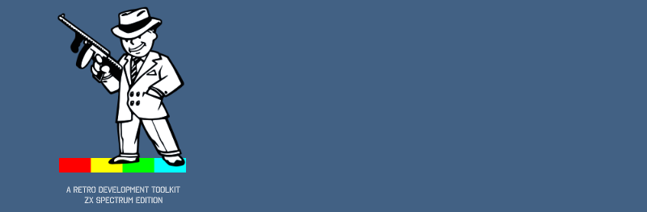

# Welcome to TommyGun
## Version 1.3
### (c) copyright 2004-2017 Tony Thompson

TommyGun is a retro development environment for creating ZX Spectrum games.

### Contact Me:
tommygun.ide@gmail.com
My name is TONY; not Tommy and not TommyGun.
TommyGun is the name of the application.

### Pasmo Z80 Assembler
http://pasmo.speccy.org/
Pasmo is used with permission from Julián Albo
Please see the Pasmo folder for open source licencing information

### Portable Z80 emulator
(c) 2007 Marat Fayzullin
http://fms.komkon.org/EMUL8/

### Quick Start Guide
Want to see what TommyGun can do but without having to write any code or draw any artwork?
Then please read the Getting Started Guide.doc for how to run the SabreWulf project.

### Whats New?
1.3.8 (June 2017)
* Scorpio VCL Components
  * Removed all unusued components and their references from all plugins
* Core
  * Fixed dialog color
  * Changed folder dialog to use Windows Select Folder dialog
* Image Editor
  * Added ZX Spectrum Next 256 color palette support
  * Added check to not load duplicate palette plugins
* Code Editor
  * Added Scintilla syntax highligher colour editor
  * Added Move to other view for side by side editing like Notepad++
  

1.3.7 (January 2017)
Minor Release Revision
* Core
  * Removed registration due to continued issues with a DLL

1.3.6 (January 2017)
Minor Release Revision
* Core
  * Fixed a bad DLL issue where Google Drive was reporting a virus in the installer.
    Was an old version of the DLL. Replaced with up to date version.

1.3.5 (January 2017)
Minor Release Revision
* Core
  * Added Silent Registration

1.3.4 (January 2017)
Minor Release Revision
* Core
  * Minor About box code change
* Code Editor
  * Fixed Settings dialog not using white parent background
  * Added a Palette Parser to output palette data table
* Image Editor
  * Minor UDG panel change
  * Added ZX Spectrum Next palette support

1.3.3 (November 2016)
Minor Release Revision
* Image Editor
  * Added a ZX Spectrum Hi Colour palette (aka. Timex Hi Color Mode 8x1)
    Use the Palette Based Image parser to output graphics data
  * Added HiColour test project

1.3.2 (July 2016)
Minor Release Revision
* Core
  * Changed main toolbar play button icon to be the same as the Code Editor play icon
  * Reformatted About Box
  * Fixed incorrect hint in About Box
* Code Editor
  * Changed the replay/time lapse buttons to green

1.3.1 (July 2016)
Minor Release Revision
* Installer
  * Added missing cc3280mt.dll to Pasmo folder
* Core
  * Adjusted labels on About box
* Code Editor
  * Fixed bug with adding a new file to a new project
  * Fixed Snapshots memory leak
  * Fixed the Debug (Run, Pause, Stop) buttons
  * Fixed Timelapse/replay buttons
  * Fixed OSB view buffer indexing issue
  * Fixed Step-Over function
  * Made c, nc, nz, pe highlight as registers to fix silly syntax highlighting

1.3 (July 2016)
Major Release Revision
* Scorpio Components
  * Fixed an issue with data entry into spin edit controls
* Installer
  * Added Install as Admin
  * Added Big Sprites Demo project
  * Added the "Library\debugstring.asm"
* Project
  * Added all source to my local Git server (no not GitHub)
  * Added missing code references
  * Developing on Windows 10 to help with finding bugs
  * Fixed project file reference errors
  * Fixed incremental linking issue with C++ Builder 2007 on Windows 10
  * Fixed all project files to have the same version information
  * Re-Added (missing) Boriel ZX Basic demo with all the example files
    Also added a %Ask% dialog so you can choose the demo to run
* Core
  * Changed the toolbar to a white background
  * Changed all clWindows to clWhite
  * Changed all clBtnFace to clWhite
  * Fixed the tool button rendering
  * Fixed the display of project name in the title
  * Fixed the missing icon for the application
  * Added Pasmo to about box
  * Added Portable Z80 emulator to about box
* Code Editor
  * Added internal Emulator (Portable Z80 emulator)
    Uses Z80 core only
	All ZX Spectrum functions added by myself
  * Added Display View
  * Added Off Screen Buffer View
    Can display multiple buffers at a time
  * Added internal Debugger
    Added support for .map files
    Added support for .dbg files
    Added functions
      Hard Reset
      Run
      Pause 
      Stop
      Step Over
      Step In
      Step Out
      Trace
  * Added Replay 
    You can go back and forth in time, up to 5 minutes.
	If you go over 5 minutes; then you keep the last 5 minutes of play.
    Snapshot Rewind
	Snapshot Forward
	Single frame stepping with
	  Alt+Left  - back 1 frame
	  Alt+Right - forward 1 frame
  * Added Breakpoints
      Supports Pass Counts
      Persisted to project file
  * Added Debug string support
    Uses rst 0 redirection
	Need to:
	  Add "debugstring.asm" from Libary to your project. It will get copied
	  Include "debugstring.asm" in your source files.
  * Added Assembler (pasmo)
    Added support for .dbg files
    Added support for .sna files
  * Added Bookmarks
    Not persisted to project file
    Not persisted if file is closed in editor and then reopened
  * Added new toolbar for debug tools, display windows
  * Fixed Goto Line dialog
  * Fixed Build chain system (AGAIN!)
  * Common Tabs
    Added Breakpoint list
      Delete, Delete All, Enable/Disable (checkbox), Enable All, Disable All, Properties
    Added custom tab drawing
    Move tabs to bottom
    Made all font sizes the same in all tabs
  * Added %ask% as a substitution variable; so you can choose a target file for a builder.
* Image Editor
  * Fixed the different font size on all image type tabs
  * Changed everything to white background
  * Added a bar at the top of the active tab
* Map Editor
  * Changed everything to white background 
  * Added a bar at the top of the active tab

1.2.1 (April 2016)
Minor Release Revision
* Core
  * Removed the big Play button
    Looked ugly
  * Added a small normal tool button (F9 still works)
  * All dialogs now have white backgrounds (not windows gray)
* Code Editor
  * Added an Editor settings page to Settings dialog
  * Improved support for finding only monospace fonts (Damn you Consolas)

1.2.0 (April 2016)
Major Release Revision
Spit and Polish release
  Probably more spit than polish ;-)
  Nicer splash, better brand colours/icons/images/fonts, bigger toolbar buttons, tabs and some fonts.
  Better support for modern OS's (Windows 8+)
  Future versions will all be ZX Spectrum ONLY!
  NO MORE MULTI-MACHINE SUPPORT
* Installer
  * Moved all projects to the My Documents\TommyGun\ folder
  * Installer will only overwrite the example projects if the new files are newer
    If you make changes to the examples files you could lose those changes
    Clone the project and make changes to that copy
* Projects
  * Convert all projects to the new Build system
  * Set all emulators to ZX Spin 0.7s; as it is more reliable on Win7/8/10 than ZX Spin 0.666
  * Added a Boriel ZX Basic demo with all the example files
  * SabreWulf (fixed again)
  * Moved all projects to the My Documents\TommyGun\ folder
* Core
  * Added a RUN button to the main page
    Can use F9 to run
  * Moved the Log files to %APPDATA%\TommyGun
  * Fixed some log file handling
  * Updated the Splash screen
  * Updated the About box
    Updated the Titlebar image
    Removed AGD reference
    Removed SynEdit reference
    Added Scintilla reference
    Removed Easter Eggs
  * Fixed the Open a project form buttons
  * Added group boxes to project screen
  * Increased the size of all main plugin titles and their buttons
  * Increased the size of ALL toolbar buttons for bigger screens (bye year 2000; hello 2016)
  * Added stencil font used by application to installer
  * Fixed writing exception log to %APPDATA%
* Code Editor
  * Handle new event to update/build/run game
  * Replaced the Old SynEdit code editor with Scintilla
    Always hated the Borland style SynEdit editor
    Scintilla has a much more Visual Studio feel to it
    Scintilla DLL is also smaller than SynEdit (1646Kb to 432kb)
  * Fixed the Find/Search/Replace functions
    Consolidated search project files/find into a single dialog
    Simplified find/replace
  * Removed the editor options
  * Added addition Boriel ZX Basic keywords to the syntax highlighter in the Code Editor
  * Removed the Tools Save button. All operations save the Tool definitions
  * Added Default parameter definition to Tool definition
  * Added Accepts Multiple Input Files to Tool definition
  * Added Accepts Multiple Input Files support to the build pipeline
  * You can now use %pfolder% in a Tools executable path. Probably only effective for project batch build file stored in the project file.
  * Added the Boriel ZX Basic Compiler as a build tool
  * If you make changes to a build tool and change to a new tool; you are asked if you want to save the changes
    Because I always forget to click update
  * Fixed an issue where the installer would make the projects folders read-only and it wouldn't build the project
  * Fixed a Z80 lexer issue
* Image Editor
  * Fixed up the UDG editor to be similar to the character editor changes
    Easier to select a character
    Added magnification

1.1.0 (April 2016)
Major Release Revision
* Installer
  * Fixed installer to remove of TommyGun files after uninstall
  * New installs won't overwrite your Tools.xml settings file
* Projects
  * Added more projects to try
    SabreWulf (fixed)
    Space Invaders (90% complete)
    Gems (90% complete)
    Noughts and Crosses (from the Getting Started Guide)
    Buddy (a hacky demo)
    Z88DK - a working Z88DK "Hello world" demo
        see main.c for ZCC setup parameters
* Core
  * Changed the Machine name to show the project folder path
  * Removed the Tips dialog
  * Enter key works in the project list to load a project
* AGD Game Editor
  * Removed AGD Arcade Games Designer 
    There is a dedicated AGD editor in development
* Code Editor
  * Changed the Build system to use a "Tools" system
    Each tool has to be defined
    Each project specifies the tools it uses
    If a tool is not setup; then it is added and the user needs to define the location of the tool
    A tool is any application that is used outside of TommyGun
        e.g. Pasmo to compile assembly, Z88DK ZCC to compile C code, ZX Spin to run the project output
    You define whether a tool is a Builder or an Emulator
        Builders are used to compile the code
        Emulators are used to run the code
    The new Tools system will convert the old settings over the new system
    Once you have setup your tools; you shouldn't have to change them
  * Fixed a really annoying bug with the Build button where it would build every ASM file and not just the one in the emulator parameters
    You can supply any number of file names or use a wildcard (*.asm, *.c etc)
    And now not needed because I rewrote the build system
  * Removed the Build Selected and Stop buttons (I never use them, not sure they even work)
  * Added an Editor Options toolbar button. I wonder how long that has been missing?
  * Play button now does it all; Saves, Updates Resources, Builds and Runs the game (simples)
  * Fixed load compiler/emulator settings issue
  * Fixed issue where double clicking to goto an error line open a non existent file. If there was not a valid file on the line.
  * Fixed issue with Parameter substitution.
    Can now use %game% to get the game project name.
    For example: %game%.tap %game%.map to produce "My Game.tap" and "My Game.map" from pasmo.
  * Added bigger switch buttons to the Editor/Build Options dialogs
  * Fixed some keyboard handling issues
  * Fixed an issue where the application would crash while opening another project when files were opened in the code editor
  * Removed %infile% build variable
  * Updated %PFolder% and %game% build variables to work better
* Image Editor
  * Improved the Font selection panel
    Fixed all the control alignment issues
    Made it easier to select a character
    Shows the selected character in the preview window

1.0.0
Full version release
Only for ZX Spectrum and only for Arcade Games Designer
* Core
  * Added Scorpio logo
  * Updated splash/about box to include mention of Arcade Game Designer
  * Changed some UI colors
  * Hack for application not exiting correctly
* Arcade Game Designer
  * Added the Game Designer for AGD
  * Added the AGD compiler to the installation (TommyGun\AGD)
  * Added the AGD game engine ASM file
  * Fixed game editor property editor not updating correctly
  * Fixed score panel for AGD window
  * Added Sound Effect file selection
  * Added Diamond Geezer example game
  * Added support for user defined character set
* Code Editor
  * Added support for Game Designer (*.agd) files
  * Added the AGD code parser to build the resources into the AGD game engine
  * Added syntax highlighting for AGD files
  * Fixed some resource insertion bugs
  * Changed code editor search dialog to tabs (from tab buttons)
  * Fixed a rebuild project issue
  * Fixed issue with AGD and loading generated .asm files
* Map Editor
  * Added AGD mode, where you can assign the player, sprites and objects to screens
  * Fixed the display of the ScorePanel
  * Fixed Map editor showing all frames for sprites
  * Fixed use of score panel
  * Added ability to set a start screen
* Image Editor
  * AGD mode where you can't resize the image types for AGD or change the palette
  * Score panels are now screens and not tiles
  * Fixed tile/sprite/screen editor panels
  * Added magnification of tiles in the tile preview window
  * Added Character set type

0.9.42
Major Release Revision
* Application
  * Changed from Borland Builder C++ 6.0 to CodeGear C++ Builder 2007
  * Removed old FlatStyle components
  * Converted all controls over to XP/Vista themes
    Realigned a lot of controls and forms
  * Fixed some Scorpio VCL components (my components)
    Removed the old 3DStudioMax slim line scroll box
    All Scrollboxes are proper Windows scroll boxes
* MSX Tables Editor (NEW MAIN PLUGIN)
  * Adandoned!
* Added new computer support
  * MSX 1
  * TI-99/4a
  * NOT the colecovision (NEVER!!!)

0.9.40,41 (???)
Lost computer HDD and lost these revisions

0.9.39 (17 May 2009)
Minor Release Revision
* Code Editor
  * Fixed a bug with detecting error info to obtain program and line nos.
    ZX Basic: Error tag: 'Error', Program tag: '', Line tag: ''

0.9.38 (21 February 2009)
Release Revision
* Image Editor
  * Added support for new machine - Timex 20xx
* Code Editor
  * Added support for Tile Indexed map exporter (Timex 20xx/Spectrum SE)
  * Fixed a Monochrome (Palette Based Image parser) bug when exporting masked sprites/tiles.
  * Started new Map exporter - but sadly its incomplete
* Core
  * Added raw map data importer (Timex 20xx/Spectrum SE)

0.9.37 (18 January 2009)
Happy New Year
Release Revision
* Paletted Images Parser (CPC, Ent64 etc)
  * Fixed masking interlace bug - finally

0.9.36 (18 December 2008)
Release Revision
* SevenuP Parser
  * Fixed C source code formatting errors
* Code Editor
  * Added support for running batch files as "compilers"
* Paletted Images Parser (CPC, Ent64 etc)
  * Fixed masking interlace bug

0.9.35 (16 November 2008)
Release Revision
* Code Editor
  * Fixed a masking bug in the ImageLibrary.dll
  * Fixed a similar masking issue in the Paletted Images Parser

0.9.34 (1 November 2008)
Release Revision
* Code Editor
  * Fixed a resource selection bug
* Map Editor
  * Added support for using sprites as animated tiles
* Map Parser
  * Rearranged the parser options
  * Added support for merging sprites as animated tiles
  * Added an option to format the tiles table

0.9.33 (24 October 2008)
Release Revision
* Code Editor
  * Fixed a bug in the selection and updating of the files list
  * Changed the Add Resource parser combo box to a list box (easier to find parsers)
  * Map Parser
    . Fixed a screen name bug
    . Added a Post Process step to allow for compressors to run on the map data
    . Added a Map Table sort order (Screens may still be stored out of order)

0.9.32 (7 July 2008)
Major Release Revision
* Example Projects
  * Updated the Space Invaders project
    . Includes the latest code and graphics
  * Added the GEMS project
    . Includes all images, music and source code to date
* Core
  * Removed the PayPal donation button on the About Box
    . Its invisible to most people so no big lost there!
  * Reformatted all editor plugins to have the titles at the top and the toolbars below.
  * Adjusted some of the TommyGun colours
  
  !!!TRY HIDING THE MAIN TOOLBAR AND SHOWING THE CHOOSER - NICE!!! ;-)

* Music Editor
  * Changed UI to a proper Music editor style
    . Bpm settings
    . Patterns (collection of notes - can be multi-channel)
    . Channels (can restrict the number of channels for a pattern)
* Code Editor
  * Hid the uncompleted Code Browser tool buttons
  * Added a Close active document to the window buttons
  * Added support for BASIC compilers - *.bas files
    . Added a BASIC highlighter
  * Added a Find In Files feature
  * Fixed bug in Palette Based Image Parser to do with Number Base
  * Vic20 parser
    . Fixed Double Height code generation issues
* Image Editor
  * Palette Base Images Parser
    . Changed the default source code selection to ASM
    . Fixed a code generator bug with ',' in arrays
    . Comments are generated by the file extension
      - .c, .cpp, .h and .hpp all use C style comment /* */
      - anything else use Asm comments ;
  * Fixed width for Sprite/Tile image types
    . Minimum width is the smallest number of pixels per byte.
  * VIC20 MultiColor palettes
    . Fixed the setting of pixels
* Map Editor
  * Fixed variable sized pixel bitmaps (aka "Fat" Pixel modes - eg. Vic20, CPC)

0.9.31 (17 June 2008)
Release Revision
* Image Editor
  * Made 4x4 the minimum image size for Fonts, Tiles and Sprites
  * Fixed Vic20 character index output for code editor data parser
  * Updated Palette Based Images data parser
    . Added C output support
    . Added size output ordering
    . Added a byte definition value eg. you can use .db DEFB DB .byte etc    
* Code Editor
  * Made the Code generator tags to be assembler and C friendly
  * Palette based parser (CPC, Ent64, C64 etc)
    . Added C Source output

0.9.30 (1 June 2008)
Release Revision
* Image Editor
  * Fixed Vic 20 palettes
  * Changed default screen size to 160x192 from 176x184
  * Fixed mask generation for all palettes
* Code Editor
  * Added a Vic20 specific code parser
  * Updated the SevenuP (Z88DK) parser
    . Includes Label Prefix and Postfix definitions
  * Added a splitter so you can resize the dialog components
  * Palette based parser (CPC, Ent64, C64 etc)
    . Includes Label Prefix and Postfix definitions
    . Fixed the mask generation values for interleaved values (CPC)

0.9.29 (30 April 2008)
Release Revision
* Image Editor
  * Fixed an image list removal bug
  * Change Vic-20 MultiColor palette design/behaviour
  * Added Vic-20 Double Height palettes for MultiColor and HiRes

0.9.28 (20 April 2008)
Release Revision
* Image Editor
  * Added VIC-20 Hires palette
  * Added VIC-20 MultiColour palette
  * Fixed up general Vista issues and palette forms
* Core
  * Made it easier to find the About Box EASTER eggs.
    . ie. Move the cursor over the red box, the silver fern and the KiwiWare text
* Code Editor
  * Added VIC-20 support to the Palette Based Images code parser/generator
  * Fixed a bug in the File List when adding files and moving items around
* Installer
  * Organised the installer Machine order to be Alphabetical

0.9.27 (5 April 2008)
Release Revision
* Updated SynEdit component to 2.0.6
* SevenuP Code Parser
  * Can now parse Monochrome images
* Image Editor
  * Fixed the FloodFill tool
* Maps Parser
  * Added support for Index only tile maps (no co-ordinates)
    . A screen should have a tile at all positions in the map
    . If a tile is missing from a position then tile 0 is used
    . All tiles must be the same size
* Map Editor:
  * Added an Overwrite tile option
  * Also now save the grid size option to the map file so set this if you use Tile index only maps
* Code Editor:
  * Added Copy to clipboard to the Console output window
  * Added new rules for jumping to output errors.
    1. If no 'error prefix' is set then only a line no. and file need to be present
    2. If 'error prefix' is set then error, line no and file must be present on the line
    3. No 'file prefix' means to just search for the first '.' to find a file from there
    4. If a 'file prefix' is set then the search for a file starts from that position on
  * The exit code is now retrieved from the output of the compiler 
    An appropriate message is displayed on success or failure
* Tutorials
  * Fixed the SabreWulf project to compile again (use Pasmo)
* Installation Files
  * Removed the TommyGun Conversion Utility
    As I'm sure no would need it by now.

0.9.26 (19 February 2008)
Patch Revision
* SevenuP Code Parser
  * Fixed number base examples

0.9.25 (19 February 2008)
Patch Release
* SevenuP Code Parser
  * Fixed a problem with the output of Attributes and Attribute Masks (Again ;-) )

0.9.24 (18 February 2008)
Patch Release
* SevenuP Code Parser
  * Fixed a problem with the output of Attributes and Attribute Masks

0.9.23 (14 February 2008)
Patch Release
* Image Library
  * Fixed a problem with the dirtiness of image rects
    Most obvious when creating 8x8 Sprites    

0.9.22 (1st October 2007-14 February 2008)
Release Revision
* Code Editor
  * Fixed bug in Spectrum Image parser when using masks
  * Fixed bug in the Text drawing tool.
  * Added a SevenuP parser for Z88DK and SP1 support
    No Interleave option: Defaults to Sprite

0.9.21 (14th June 2007)
Release Revision
* Map Editor:
  * Finally implemented the new tile drawing tools
    Should help to make drawing levels easier
    Free          - place tiles anyway
    Line          - Draw tiles in a line
    Rect          - Draw an unfilled rectangle of tiles
    Filled Rect   - Draw a filled rectangle of tiles
    Circle        - Draw an unfilled circle of tiles
    Filled Circle - Draw filled circle of tiles
  * Sped up moving of large selection of tiles
* Image Editor:
  * Added an Import Image Sheet dialog (under File|Import)
    Allows you to import tiles or sprites from within a large image sheet
    with many scattered images in it.
  * Fixed image resizing to also resize the mask of all frames
  * Fixed image resizing to allow resizing while the mask mode is on
  * Fixed the Generate Mask tool to generate masks for all frames of an image
  * Fixed a bug in creating masks when the image width is not a multiple of 8
  * Added a Set Hot Spot marker (and a toggle button to show/hide it)
    WTF is a Hot Spot? Well best off not to be using it then eh! :)
  * Fixed a bug where the Animation Frame Helper would freeze on Frame 0

0.9.20 (4th June 2007)
Release Revision
* Demo Projects
  * Fixed the SabreWulf demo to build correctly
  * Fixed the Noughts and Crosses demo to build correctly

0.9.19 (17th March 2007)
Release Revision
* Core:
  * More DPI issue fixes
  * Fixed Window restore when starting up in maximized window mode
* Image Editor:
  * Fixed magnification problem (from Font issue)
  * Fonts Plugin
    * Fixed font names list
* Map Editor:
  * Fixed the Score Panel div by zero bug

0.9.18 (3rd March 2007)
Release Revision (EP64/128)
* Code Editor:
  * Fixed Sam Coupe Mode 3 & 4 parser output
* Image Editor
  * Fixed SpectrumNext256 64/128 16/Attribute palettes
  * Fixed images limited to 512 pixels wide.
  * Limited magnification of images to 2048x2048 pixels
    (due to memory and Win32 resource limitations)
  * Fixed bug with Fill draw tool (temporary fix)
* Core:
  * Fixed DPI issues within main plugin area

0.9.17 (20 February 2007)
Release Revision
* Machines
  * Added new machine - SpectrumNext256 64/128
* Map Editor:
  * Fixed a Home/End key conflict with the code editor
  * Fixed some settings components
  * Moved tool buttons onto different toolbars
  * Fixed the 16 colour map window bug
* Code Editor:
  * Added C and CPP comments as valid comments for Z80 Assembler.
  * Fixed F3 jumping bug
  * Fixed Spectrum Image Parser always producing attributes
  * Changed Spectrum Image Parser to be a generic Attribute parser
    - works for ZX Spectrum, Sam Coupe, SpectrumNext256 64 etc
* Image Editor
  * Added SpectrumNext256 64/128 - 2/4/16/256 colour palettes
  * Fixed Sam Coupe Mode palettes
    - fixed incorrect colour orientation (Mode 3&4)
    - fixed incorrect attribute information (Mode 2)
  * Added Machine logos to all colour palettes
  * New improved color selection dialogs

0.9.16 (23 December 2006)
Release Revision
* Image Editor:
  * Added selection move and clone
    - Hold ctrl to clone(copy) the selection and move it
    - Hold shift to snap the mvements to the grid (as per usual)
  * Added an Arbitary Rotate
    - New button on the image tools toolbar (has red dots)
    - Can rotate an image to ANY angle from ANY centre point WITHIN the image
    - CANNOT rotate selection at the moment only the whole image
    - and as per all the other rotate/mirror/flip function it only operates on the current frame 
* Map Editor:
  * Fixed the tile selection indicator bug
  * Fixed a bug with restoring/saving tile backgrounds
* Code Editor:
  * Added a Clear Console options to the build options

0.9.15 (13 December 2006)
Release Revision
* Code Editor:
  * Fixed Build and Run shortcut keys
    Ctrl+F9 to compile
    F9 to run (will compile project if its changed)
* Map Editor:
  * Added Map menu
  * Added Save Map as Bitmap (in Map menu)
    Saves the map at the current scale
  * Add Multiple selection
    Changed the way add tiles works (ever so slightly)
    - Do rectangle select by selecting an empty area first then click and drag
    - Can add to selection with Ctrl - sorry no removal at the moment
    - click a blank area to clear the selection
  * Fixed Undo/Redo of screen selection
    - updated undo/redo to work with multiple selection
  * Added Screen swap in screen editor (lower window)
    - Hold Shift while dragging a screen and drop it on the screen you wish to swap with
  * Added Clone Tile selection
    - Select tiles
    - Hold Ctrl while click on a selected tile and moving/dragging it will clone the selection
  * Added Copy/Cut and Paste of tiles
    - Can paste to other screens
* Core:
  * Added a copy project feature
    You can use projects as base projects or project templates
    Thanks to Skarpo on WoS for the tip

0.9.14 (1 Nov 2006)
Release Revision
* Image Import:
  * Added support for creating images with a mask
* Image Editor:
  * Fixed a problem with Masked mode
  * Added Generate Mask functionality
  * Added a Show Previous Frame Underlay toolbar button (toggle animation helper)
    This should help when doing animation so you can compare one frame
    to the next (or current frame)
    The underlay uses the mask colour and transparency values, so
    you can use the transparency slider to fade between the current frame
    and the previous frame
* Strings Editor:
  * Added the new string table editor
  * Also a new parser for the strings (see CodeEditor)
* Code Editor:
  * Added a string table parser

0.9.13 (13th Oct 2006)
Superstition Release
* Skipped because I don't like the number 13. ;-)
  Plus its black friday.

0.9.12 (12th Oct 2006)
Release Revision
* Code Editor:
  * Fixed a DEL key bug in the project files list
* Map Editor:
  * Fixed a transparency bug
* Image Importer:
  * Fixed a SevenuP image import bug

0.9.11 (1st Oct 2006)
Release Revision
* Machines:
  * Added initial support for Jupiter Ace and Jupiter Ace 4000
    - Added palette plugin
    - Added code parser
    - Added UDG support
* Code Editor:
  * Added editor properties dialog
    - can customise the text editor
      Colour schemes
      Key mappings
      Display properties
      and General Editor properties
  * Moved the build settings to a new dialog box
  * Added the Jupiter Ace Chunky graphics parser
  * Updated to version 2.0.3 of SynEdit
  * Added ZigZag support to ZX Spectrum image parser
  * Added Mask BEFORE or AFTER for mask pixel pairs to ZX Spectrum image parser
  * Added ability to remove Attributes from ZX Spectrum image parser
  * Fixed C64 palette drawing bug
* Image Editor:
  * Added the Jupiter Ace Chunky graphics palette
  * Fixed copy/cut/paste bug
  * Fixed image tools bug
  * Added image resizing
    Only Sprites and Tiles are resizeable
  * Images can now be any width and any height
    WARNING!!!Be aware that non byte aligned values could act strangely!!!
  * Added an Invert Mask button
  * Fixed Mask mode button (to apply to all frames of an image)
* Map Editor:
  * Tiles are by default transparent
  * Supports Masked Tiles

0.9.10 (7th Sept 2006)
Release Revision
* Projects:
  * Fixed SabreWulf project

0.9.9 (6th Sept 2006)
Release Revision
* Code Editor:
  * Yet more changes to the Amstrad CPC code parser
    Hopefully working completely
* Image Editor:
  * Again changes to the Amstrad CPC palettes
    Hopefully fixed for good!
* Core:
  * Added TommyGun website link to About box

0.9.8 (5th Sept 2006)
Release Revision
* Image Editor:
  * Fixed major bug in all palette plugins
    All 1.0 projects will be automagically fixed once loaded and 
    saved in the correct format once save is clicked.
    New project version is now 2.0 up from 1.0
* Code Editor:
  * Fixed all the parsers to use the new correct palette formats
  * Pretty sure the CPC parser is now 100% correct
  * Added Pixel Row Order to palette based parser
    You can order pixel rows classically ie. left to right stacked
    Or Zig Zagged in left to right then right to left alternating rows
* Scorpio VCL Components:
  * Fixed problem with XML files and double quotes

0.9.7 (27th Aug 2006)
Release Revision
* Image Editor:
  * Tiles can now be masked
* Code Editor:
  * Added more options to the Paletted based Image Parser
    This is to support interlaced byte formats for palette indexes
    e.g. Amstrad CPC.
    Sorry - Custom bit remapping is incomplete at present
  * Added a Number base option to image parsers to output numbers in any base.
  * Added a new ZX Spectrum SCREEN$ parser

0.9.6 (25th July 2006)
Release Revision
* Code Editor:
  * Fixed the palette image parser
    Now parsers the Amstrad CPC palettes correctly.
    Should now work for Monochrome and C64 as well.

0.9.5 (12th July 2006)
Release Revision
* Minor fixes

0.9.4
Release Revision
* Code Editor:
  * Fixed copy/cut/paste problem in edit boxes in the settings tab
  * Fixed tab order in settings

0.9.3
Release Revision
* Main Framework:
  * Added a new Backup and Restore feature
    It can be configured from the options dialog
    It also adds an extra button on the Start up page, that allows you to
    choose a project to restore.
    You cannot currently restore Deleted projects, this has to be manually at present.
  * Made all the Options icons have a blue theme :-)
  * Minor re-styling of the options page layouts
  * Removed the old problems dialog - not needed for new xml files
  * Updated to some WinXP menu icons
  * Fixed Window size and position restore (well for a single monitor system anyway)
  * May of fixed the sticky dirty flag bug (maybe!)
  * Updated the About box to include Copyright information.
  * Fixed some start screen component colours
* Code Editor:
  * Fixed a couple of problems with the Load File button
    Now correctly copies any files not in the project folder into the project folder
    Also renames any files that have spaces to use underscores
    Makes jumping to error statements after a compile easier :-)
  * Paletted based image parser. 
    Fixed handling of masks.
    Changed default endianess to Big endian (Z80)
  * Fixed a problem with the code editor creating a blank tab
  * Fixed a GotoLine bug when no file was being edited
  * Removed the main menu icon for GotoLine as it was the wrong one
  * Improved the Build and Run commands with respect to dirty files
  * Change title from "Text Editor" to "Code Editor"
* Image Editor:
  * Font Editor
    Fixed a problem with the font naming of each character
    Will fix old fonts automagically as they are loaded
    Fixed the character button hints 

0.9.2
Release Revision
* Image Importer:
  * Changed all import modules to use ifstream instead of fopen/fread
  * Fixed the reading of the mask values from a SevenuP file
* Code Editor:
  * Implemented the update resources before building option
  * Implemented the save files before building option
  * Implemented Jump to error if build fails
  * Implemented build project if dirty before running
  * Changed Run shortcut from F5 to F9 to match Borland compile and run shortcuts
  * Added Build Presets option to allow easier 
    access to preset build environment variables
  * Added a new command line variable %game% to help 
    supply default command line parameters.
  * Updated the Update resources button so now you don't need to have a
    file loaded for its resources to be reparsed.
* Image Editor:
  * Fixed masked images not added new frames correctly
  * Fixed bug where mask mode wasn't honoured when a new frame was created or cloned

0.9.1
Release Revision
* Image Editor:
  * Added mouse wheel zoom in/out for an image
  * Fixed a problem with the grid toolbar buttons
  * Fixed an annoying copy/cut/paste bug in the image editor
* Code Editor:
  * Fixed incorrect cursor position information on status bar

0.9.0
Minor Release Revision
* Internal revision change over

0.8.9
Release Revision
* Main Framework:
  * Fixed how the short-cut keys are shared between plugins
  * Added the Terminate button to the Exception dialog
* Image Editor:
  * Fixed the selection cursor hot spot
  * Fixed delete to remove the selection of an image
    But only when NOT in an editable Win32 control
  * Fixed copy/cut/paste selection problem
    Selection rect reset to full image size once c/c/p is complete
  * Can create tiles of any height if the palette supports it
  * Fixed the Exceptions Dialog - added the terminate button
  * Fixed CPC modes
    Mode 1 uses square pixels
    Mode 0 uses fat    pixels
    Mode 2 used thin   pixels
  * Fixed Line Drawing Tool
  * Fixed Sprite and Tile image viewers
  * Added a key panel to the options panel - to show the Shortcut keys
* Map Editor:
  * Fixed problem with the Tile browser not updating when new tiles are created
  * Implemented ShortCut keys
  * Added Shortcuts keys panel to the options
* Code Editor:
  * Added a key panel to the options panel - to show the Shortcut keys

0.8.8
Release Revision
* Image Editor:
  * Fixed a divide by zero error in the new Custom Mode Scale Adjust feature
  * Fixed bug with Centering image on and auto mag off, 
    and not showing all of image correctly
* Code Editor:
  * Fixed Rename option so it renames the file tab if the file is open

0.8.7
Release Revision
* Image Editor:
  * Improved palette importing of bitmaps
  * Added a Mode Scale Adjust options to the settings
    This allows a 1x1 pixel view of "fat" hardware modes on certain machines such as,
        Amstrad CPC Modes 0 & 1
        Commodore C64 hi-res mode
        Sam Coupe Modes 3 & 4

0.8.6
Release Revision
* Fixed donations button to point to the correct email location
* Image Editor:
  * Completed the UDG image type
  * Completed the Font image type
  * Fixed palette bug in ZX Spectrum, Monochrome, Sam Coupe Modes 1 & 2
* Code Editor:
  * Fixed a bug with multi-file tabs
  * Fixed a bug with the removal of files
  * Fixed a bug with MoveUp and MoveDown button for project list
* Installer
  * Placed the Music Composer and the Memory Map editor into an Experimentals Section
  * Customized the Installer a little
  * Added a TommyGun.tips file - still need to add new tips to it

0.8.5
Release Revision
* Added a Getting Started Guide
  Guides you through the process of running the SabreWulf project and
  also on how to create a working game.
* Bug fixes
      * All palettes except the ZX Spectrum and Sam Mode 1 can have any height of sprite or tile
        All images still MUST have a width that is a multiple of 8!
        This limitation will be removed later
      * Fixed a placement problem with certain dialogs (including some palette dialogs)
      * Fixed sprite list item selection problem
* Main Framework:
    * Added project delete button to the startup screen when hovering over a project entry
    * Updated Undo/Redo
        * Supported by Image Editor and Map Editor only
          * Code Editor is a 3rd party tool that requires much work to integrate 
            into my Undo/Redo system, so Undo/Redo buttons disabled while in Code Editor
          * Added many configuration options for Undo/Redo
* Map Editor: 
    * Added Zoom factor for tile browser
    * Fixed the selection tool from jumping to the origin of an object
    * Fixed the score panel (I think)
* Image Editor: 
    * Palette updates
      * The screen editor now includes all default screen sizes for each screen mode
    * Palettes show wide pixels for mode where it is required eg. CPC Mode 1, 2
      * Fixed masking of other palette types (besides the ZX Spectrum)
      * Updated all palettes to be able to convert bitmaps formats
          (enables the palette to support copy/cut/paste and image tools)
    * Implemented Image Shift/Rotate/Mirror and Flip operations
    * fixed some Settings controls
    * Implemented Copy/Cut and Paste for Image Editor
      * Added Undo/Redo for Cut, Paste and the Image tools (shift/scroll, rotate, mirror, flip)
      * Supports pasting images from an outside source
    * Supports copying/cutting the bitmap to the clipboard
    * Added Selection tool cursor in the Image Editor
* Code Editor: 
    * Added tabbed multi-file support
    * Added goto error line in the console window (double click, or right click popup menu)
    * Added save console window to file
    * Improved syntax highlighting for Z80 assembler
    * Added syntax highlighting for C/C++
    * Added normal text mode highlighter (ie. no highlighting) 
    * Fixed the find text dialog
    * Find and Replace dialogs get the current text selection or word at cursor now
    * Implemented the file statistic panel
* Music Composer:
    * Added the beginning of a Music Composer (similar to BASin's Beep composer)
      !!!WORK IN PROGRESS!!!
* Memory Layout:
    * Started on a memory layout editor
      Requires memory.xml file in each machine folder to be defined
      Only supports the 48K Spectrum at present
      Will be able to read .maps files to fill in blocks of memory
      !!!WORK IN PROGRESS!!!

0.8.4
Release Revision
* SAM Palettes for Modes 1 - 4
  1 & 2 - Has fixed ZX Spectrum colours 
        These are not defineable from the std 128 colour palette
  3 & 4 - User can define the colours from the std 128 colour palette
* Completed Undo/Redo for the Image, Map and Code editors
* Finished Undo/Redo for ImageEditor
  Works on Creation, Deletion, Cloning, Rename, Selection

0.8.3
Release revision
* ZX Palette BUG FIX!
* Some other minor bug fixes.
* Added full Undo/Redo system (disabled in the Image editor until next release due to bug fixes)
* Added a Short-Cut Keys panel to the options page (again incomplete due to rushed bug fix release)

0.8.2
Release revision
* Fixed the CPC Mode 1 & 2 palettes to show the correct system default colours.
* Fixed the CPC and C64 palettes to save the user configured colours for a project.
* Added the Sam Coupe Mode 0 and Mode 1 palettes

0.8.1
Release revision
* Added the C64 and Amstrad CPC colour image palettes.
  Includes masking ability
* Also added the Palette Image Parser for the C64 and CPC and similar palette based machines.
* Updated the source code to the SabreWulf project.
* Enabled the outputting of mask data in the ZX Image parser
* Made the Image Editor grid colours configurable.

0.8.0 and earlier
Major revisions
* HEAPS OF STUFF

Legal stuff.
============
TommyGun is freeware and is (c) copyright 2004-2016 Tony Thompson.
You cannot distribute TommyGun without my permission and without giving me credit.
And you MOST certainly cannot charge for TommyGun.
Anything you make with TommyGun is all yours of course.

I hope you enjoy using TommyGun!
